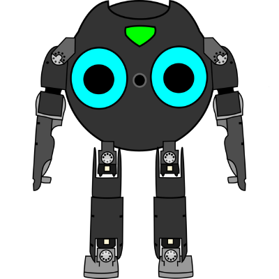

# Bit-Bots Software Stack

[](https://github.com/bit-bots/bitbots_meta/actions/workflows/build.yml)

This git repository contains all RoboCup-related code and documentation from the Hamburg Bit-Bots team.
All code is written as individual ROS 2 packages targeting Ubuntu.

<p align="center">
  
</p>

## Installation

Full step-by-step instructions for installing the Bit-Bots software stack and ROS 2 can be found in our documentation [here](https://doku.bit-bots.de/meta/manual/tutorials/install_software_ros2.html).


## Update the codebase

If you want to update this repo, all third party source files as well as the supplementing files, run

``` bash
make pull-all
```

If you encounter any problems consider cleaning the third party source files (the `lib` folder) first:

**THIS DELETES ALL CHANGES YOU MADE TO THE THIRD PARTY SOURCE FILES**

``` bash
make fresh-libs
```

## Run auto formatting

To format all code in the repository, run

``` bash
make format
```

## More documentation

Our documentation is hosted on [docs.bit-bots.de](https://docs.bit-bots.de/).
