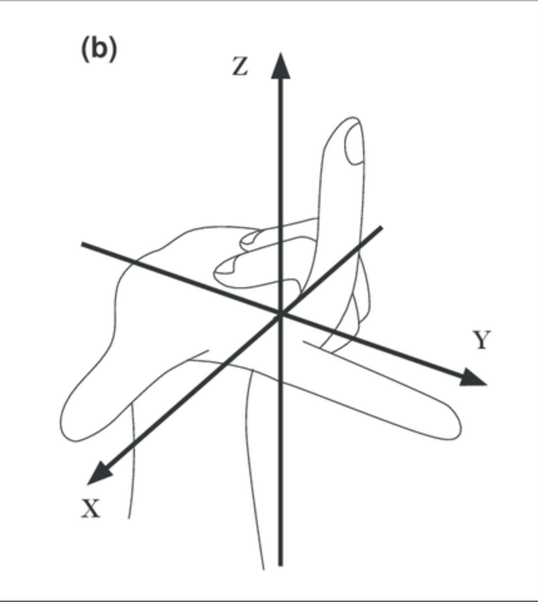
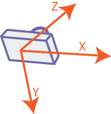

=============================
How to: Extrinsic Calibration
=============================
| As robots frequently tumble and fall down, we need to adjust not correctly aligned parts of the robots in their calibration.
| Additionally, we need the `Inverse Perspective Mapping (IPM) <https://ipm-docs.readthedocs.io/en/latest/>`_
to map correctly camera pixels to field coordinates.

In order to adjust the calibration of the visualization you can change the roll (:code:`offset_x`), pitch (:code:`offset_y`) and yaw (:code:`offset_z`) of the camera and the IMU.
The camera parameters change the camera direction and the IMU parameters change the orientation of the body.

Setup
=====

1. Start the visualization launch-file including the necessary motion and vision nodes.

.. code-block:: bash
ros2 launch bitbots_extrinsic_calibration viz_extrinsic_calibration.launch

2. In Dynamic Reconfigure open the parameters (left panel) for the nodes: :code:`bitbots_extrinsic_imu_calibration` and :code:`bitbots_extrinsic_camera_calibration`.

Do the calibration
==================

1. Open config file in **bitbots_misc** > **bitbots_extrinsic_calibration** > **config**

2. Open rqt and navigate to **Plugins** > **Configurations** > **Dynamic Reconfigure** where you can configure the parameters.

.. note::
  If you change the calibration first change all parameters to :code:`0.0`.
  Then start with the adjustment of the IMU parameters.

  This is an interactive process and we might need to do a few alternating steps of imu and camera calibration to get a good solution

IMU Parameters
--------------

* change if the lines are unequally distanced to the right/left (:code:`offset_x`) or to the front / sides (:code:`offset_y`)
* has a `right-handed coordinate system <https://www.ros.org/reps/rep-0103.html#coordinate-frame-conventions>`_

Camera Parameters
-----------------

* change (:code:`offset_x`) if all lines are too far away or too close
* change if the lines are not aligned equally on both sides / front (:code:`offset_y`) due to the rotation of the head which leads to an error in the cameras frame of reference being present in all directions
* has a `camera coordinate system <https://www.ros.org/reps/rep-0103.html#suffix-frames>`_

