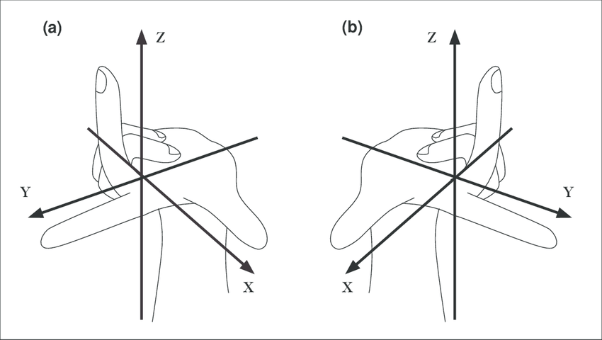

# How to extrinsic calibration
In order to adjust the calibration of the visualization you can change the roll (offset_x), pitch (offset_y) and yaw (offset_z) of the camera and the IMU.
The camera parameters change the camera direction and the IMU parameters change the orientation of the body.

1. Start teamplayer.

    ```rl bitbots_bringup teamplayer.launch game_controller:=false behavior:=false```

2. Start robot remote control.
    
    ```rr bitbots_teleop teleop_keyboard.py```

3. Press key **1** for the look around head mode.

4. Start rviz2.

    ```rviz2```

5. Open config file in **bitbots_misc &rarr; bitbots_extrinsic_calibration &rarr; config**

6. Open rqt and navigate to **Plugins &rarr; Configurations &rarr; Dynamic Reconfigure** where you can configure the parameters.

If you change the calibration first change all parameters to 0.
Then start with the adjustment of the IMU parameters.

## IMU parameters
* change if the lines are more far away on one side / to the front
* has a right-handed coordinate system
<p>
  
</p>

## camera parameters
* change if its not aligned equally on both sides / front
* has a camera coordinate system
<p>
  
</p>
