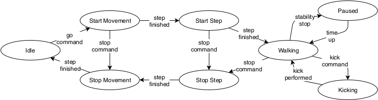
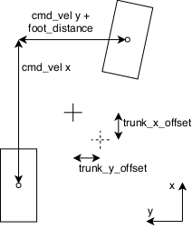

Welcome to |project|'s documentation!
================================================

This document describes how the bitbots_quintic_walking works and shows how walking parameters can be tuned.
The quintic walk is originally based on the IKWalk of team Rhoban, that is briefly described in the following paper: Rouxel et al. "Rhoban Hardware and Software Open Source Contributions
for RoboCup Humanoids", 2015.
There are a number of improvements that were made by us and there is almost nothing left from the original IKWalk code.
Improvements:
  - Refactoring the complete code base to make it more understandable
  - Including a small state machine to handle the the start and stop steps differently
  - Adding the possibility to perform small kicks during walking
  - The original phase rest (not ending the stept till the foot pressure sensors have ground contact) is expanded to also stop the step earlier if ground contact is made (phase reset)
  - Phase rest and reset can be done based on the joint torques if no foot pressure sensors are available
  - Additional stabilization is realized by applying an IMU based PD controller that keeps the correct orientation of the torso in fused angles
  - Adding a ROS interface including dynamic reconfigure for the walk parameters
  - Adding a computation of the odometry based on the actual step that was taken, rather than the planned step, to improve accuracy
  - Adding parameters that limit the step length to prevent executing steps that make the robot fall
  - Adding parameters to scale the step length so that the resulting walk speed is closer to the desired speed
  - Including Python wrapper for the walk so that it can be used without ROS, especially for optimization and learning
  - Automatic parameter optimization using the Optuna library

There is no paper just about the walk engine itself, but it has been mentioned in the following ones:
  - Bestmann et al. "Wolfgang-OP: A Robust Humanoid Robot Platform for Research and Competitions"
  - Putra et al. "Humanoid robot pitch axis stabilization using linear quadratic regulator with fuzzy logic and capture point"

General Structure
=================

The walking consists of three main parts:

1. The ROS node (walk_node.cpp) which is the main class controlling the walking and connecting it to ROS
2. The walking engine (walk_engine.cpp) which generates cartesian poses of the flying foot and the trunk in relation to the support foot based on quintic splines.
   It uses internally a finite state machine to track the state of the walking.
3. The inverse kinematic which computes the necessary joint values to reach the computed cartesian poses. We use BioIK or KDL for this through the MoveIt! interface.

.. image:: _static/approach.png

Quintic Splines
===============
Splines are a mathematical method to describe a curve using spline points. Have a look in the internet for more details.

We use quintic splines to be able to define the position, velocity, acceleration and jerk at each spline point. This enables us to generate smooth trajectories in the cartesian space.

We currently use an ROSified version of Rhobans spline implementation from the bitbots_splines package. The x-axis is always the time while the y-axis is the value of position or rotation.

The Walking Engine
==================

The core part of the walk is the spline engine that generates a fixed height and fixed cycle gait.
It uses quintic splines to represent the Cartesian trajectory of the moving foot and the torso in the support foot frame.
Each trajectory consists of six splines which represent one dimension of translation or rotation each.
After finishing one step, the splines are computed for the next step. Their form depends on a small set of parameters (see Figure below), the goal walk velocity (cmd vel ) and the type of step.
Therefore, no dynamic model of the robot is necessary, which allows easier use, especially on self-build and low-cost platforms, where an exact dynamic model is not available.
In RoboCup, such direct parameterized approaches showed great potential (see S. Behnke. "Online trajectory generation for omnidirectional biped walk-ing").
At each control cycle step, the splines are interpolated to get the Cartesian goal position of the moving foot and the torso.

The walking engine consists of mainly two methods. One builds the splines for the next step and one gives the poses for trunk and flying foot at a given time point in the trajectory.

The engine uses a fixed time frame for the step which can be changed by the frequency parameter. In order to simplify the splines and make them independend from the frequency, a so called "phase time" is used. Therefore, changing the frequency just compresses or stretches the splines in the time axis.
The engine handles two trajectories for the flying foot and the trunk. This results in 12 splines, since we need each 3 splines for position and 3 for rotation. Additionally there are some splines having meta data like which foot is the support foot. Each step starts with the double support phase and ends with the single support phase.

When the next step is computed, the last positions, velocities and accelerations are used as start points for all splines, meaning as the first spline point at time 0. Afterwards, other spline points are added. Thoses points are pre programmed but their x and/or y values can be influenced by either parameters or the desired step length. Usually those points are on meaningful time points like the switch between double and single support.

Since these trajectories are only build when doing a new double step, changes in parameters or walking commands are only shown when the current double step is finished.
The method which computes the poses at a given time point only takes the prebuild splines and computes the values for each of the splines using the mathematical spline interpolation.

.. image:: _static/engine_params.png

The Walking Node
================

The walking node subscribes to the /cmd_vel topic which provides a Twist.msg commanding the velocities in x,y and yaw. If it receives only zeros, it will completely stop. If there are values present, the node calls regularly the engine to get the next cartesian poses. Since those poses are in the support foot frame, it translates them to the base_link frame and calls the IK to get the corresponding joint values. These are then published as new goals for the servos.
Furthermore, the node computes the walking odometry by adding up the changes to the robots pose from each step. This odometry is then published and used by the localization. Since the robot does not slide very much, the odometry is close to the truth.
The node also publishes a debug topic where it provides information on the splines, as well as RViz marker messages.

To be able to change the parameters of the walking, the node provides a dynamic reconfigure interface. Each time a parameter is changed, the new parameters are handed to the walking engine.

The Stabilizer
==============

To increase the stability of the walking, different loop-closure approaches based on different modalities are implemented.

The phase reset uses the data of the foot pressure sensors or the joint torque sensors to detect, when the moving foot makes contact to the ground.
At this moment, the phase is reset to 0 and the support foot is changed.
This means the step is ended early.
This prevents the moving foot from pushing further into the direction of the ground, thus introducing a force on the robot.
Similarly, the phase rest prevents the starting a new step until contact is made to the ground.

The stability stop detects if the robot is becoming unstable in the walk, based on the IMU and pauses the walking at step change for a short amount of time.
During this, oscillations of the robot can settle themselves. When the robot is not oscillating anymore, it starts to walk again.

A PD controllers is applied to adapt the Cartesian poses of the robots torso based on input from the IMU.
This prevents the robot from tilting slowly to one side.
The controller uses the robots orientation measured by the IMU to compute an offset to the torso rotation in fused angles.

Parameter Tuning Guide
======================

There are two ways to tune the walking parameters:
- manually
- using the automatic parameter optimization

This part will explain the manual tuning. Look below for the automatic tuning (which should be preferred).

The Quintic Walk tries to rely on as few parameters as possible and most of them should be independent from each other, meaning changing one does not require a change in another parameter.
When tuning parameters following things should be kept in mind:

1. Make sure the robot has no hardware problems, e.g. loose screws. Otherwise your tuning is kind of senseless
2. Use slow motion videos from smart phones to debug the walking. This way it is much easier to see what is happening.
3. Test different walking directions and speeds. Parameters may work perfectly when moving forward but will fail catastrophically when walking sidewards.
4. When tuning completly new, first do it in rviz. This lets you tune at least to the point where it looks like it works and prevents damage to the robot by colliding legs.
5. First tune open loop (without any PID control or phase reset). Otherwise problems from these parameters are maybe hidden by the stabilization approaches.

Tune the parameters in the following order:

1. foot_distance: Set this so that the feet are under the hip or slightly outwards of them
2. trunk_height: This is a trade off between high (legs are completely straight) and low (knees are bend). The more the knees are bend the more torque is applied to the knees (this is bad) but the maximal step length gets longer since the kinematic chain allows more movement of the flying leg (this is good). Good values are normally slightly bend knees.
3. trunk_pitch: This should be set so that the robot is stable in pitch direction while standing still. Any pitch necessary from walking faster is coming from another parameter.
4. foot_rise: This highly depends on the ground. For hard floors, just a centimeter should be enough. For artificial grass its around 5cm. Tune it so that the flying foot does not touch the ground while moving. Larger than necessary values are probably bad since they result in larger accelerations.
5. freq: This determines how fast your steps are and thereby also how fast you can run since the maximum speed ist maximal step length times step frequency. Faster steps also mean a shorter absolute single support time which often results in a more stable walk. Since each step leads to a small odometry error, a higher frequency leads to more odometry errors. Typical values are between 0.5 and 1.5 steps/s.
6. double_support_ratio: This determines how long per step both feet are on the ground. It should never be zero, since this will most likely not work because the accelerations for the body would get infinitive on step change (see "Introduction to Humanoid Robotics, Shuuji Kajita, 2015" for a detailed explaination). To large values will force the flying leg to move very fast during single support. This value can be fine tuned after setting the other values. Typical values are between 0.05 and 0.3.
7. trunk_swing: This value determines how much the torso is moving sidewards during walking to put the center of pressure over the support foot. If the robot is falling to the inside of the support foot the value has to be increased, if it is falling to the outside it has to be decreased. The value of 1 means that it goes during maximal sidewards movement as far as the footDistance. Typical values are between 0.1 and 1.
8. trunk_phase: This moves the trunk movement in relation to the leg movement in phase time. This is difficult to tune but often the value that you want to change when you don't know why the walking doesn't work. Typical values are between -0.1 and 0.1.
9. trunk_pitch_p_coef_forward: This gives more trunk pitch when running forwards and less when running backwards. Increase this when the robot is falling to the front or back when getting faster.

The other values are mostly not that influential but can also be tried.

Automatic Parameter Optimization
================================

As tuning manually is very tedious and does not always yield the best parametes, we apply automatic hyperparmeter optimzation.
This is done using the Multi-objective tree-structured Parzen-estimator (MOTPE) algorithm.
Each of the walking directions (forward, backward, sideward, turning) is one of the objectives which should be optimized.
MOTPE decides on a set of parameters and we let the robot walk in each direction for a few seconds with increasing speed until the robot falls.
The objective value of this direction is the maximal speed that the robot reaches without falling.
Based on the already tried parameter sets and their objective values, MOTPE decides on the next parameter set to try.

The code for this is in the following github repository: https://github.com/bit-bots/parallel_parameter_search/
You will need to execute the 'optimize_walk' script.
See the help of the script for more information.
There are other optimization algorithms to chose from, but MOTPE has yielded the best results in our experiments.
You will typically need 500 to 1000 repetitions to get good results.
You should also use the '--storage' option to store the results in a SQL database.
This will also allow you to parallelize the optimization by executing the script multiple times.
Look at the documentation in this git for more information.

.. toctree::
   :maxdepth: 2

   cppapi/library_root
   pyapi/modules

Indices and tables
==================

* :ref:`genindex`
* |modindex|
* :ref:`search`
