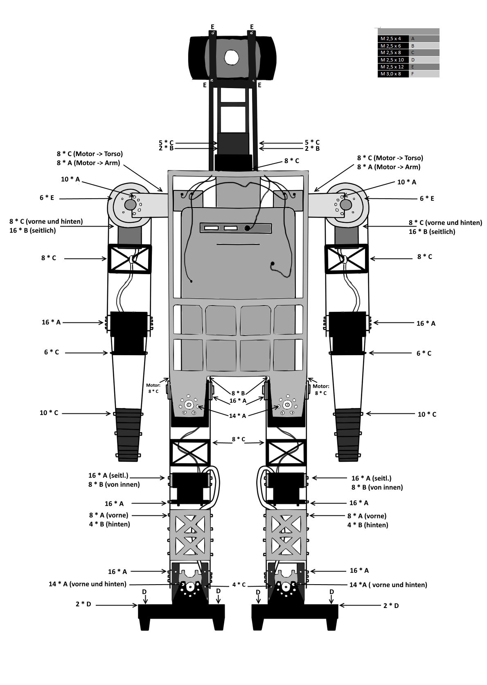

===============
Schrauben
===============

Wolfgang
===============
Nach Position
-------------
+----------------------------------------+----------+--------+------------+
| Position                               | Typ      | Anzahl | Pro Roboter|
|                                        |          |        |            |
+----------------------------------------+----------+--------+------------+
| Kamerahalterung                        | M2,5x12  | 4      | 1          |
+----------------------------------------+----------+--------+------------+
| Kopf -> HeadTilt                       | M2,5x8   | 10     | 1          |
+----------------------------------------+----------+--------+------------+
| HeadTilt -> HeadPan                    | M2,5x6   | 4      | 1          |
+----------------------------------------+----------+--------+------------+
| HeadPan -> Torso                       | M2,5x8   | 8      | 1          |
+----------------------------------------+----------+--------+------------+
| Protektoren Oberkörper                 | M2,5x8   | 3      | 4          |
+----------------------------------------+----------+--------+------------+
| L/RShoulderPitch -> Torso              | M2,5x8   | 8      | 2          | 
+----------------------------------------+----------+--------+------------+
| L/RShoulderPitch -> Schulter           | M2,5x4   | 8      | 2          |
+----------------------------------------+----------+--------+------------+
| L/RShoulderRoll -> Schulter            | M2,5x4   | 10     | 2          |
+----------------------------------------+----------+--------+------------+
| Schulterprotektoren                    | M2,5x12  | 6      | 2          |
+----------------------------------------+----------+--------+------------+
| Schulterprotektoren -> L/RShoulderRoll | M2,5x?   | 4      | 2          |
+----------------------------------------+----------+--------+------------+
| ShoulderRoll -> Oberarm (vorne/hinten) | M2,5x8   | 8      | 2          |
+----------------------------------------+----------+--------+------------+
| ShoulderRoll -> Oberarm (seitlich)     | M2,5x6   | 16     | 2          |
+----------------------------------------+----------+--------+------------+
| Oberarmstabilisator                    | M2,5x8   | 4      | 4          |
+----------------------------------------+----------+--------+------------+
| L/RElbow -> Oberarm                    | M2,5x4   | 16     | 2          |
+----------------------------------------+----------+--------+------------+
| L/RElbow -> Unterarm                   | M2,5x8   | 6      | 2          |
+----------------------------------------+----------+--------+------------+
| Handstabilisator                       | M2,5x8   | 10     | 2          |
+----------------------------------------+----------+--------+------------+
| L/RHipYaw -> Torso                     | M2,5x8   | 8      | 2          |
+----------------------------------------+----------+--------+------------+
| L/RHipYaw -> Hüftgelenk                | M2,5x6   | 8      | 2          |
+----------------------------------------+----------+--------+------------+
| L/RHipRoll -> L/RHipPitch              | M2,5x6   | 8      | 2          |
+----------------------------------------+----------+--------+------------+
| L/RHipRoll+Pitch -> Hüftgelenk (v./h.) | M2,5x4   | 14     | 2          |
+----------------------------------------+----------+--------+------------+
| L/RHipRoll+Pitch -> Hüftgelenk(seitl.) | M2,5x8   | 4      | 2          |
+----------------------------------------+----------+--------+------------+
| L/RHipPitch -> Oberschenkel            | M2,5x4   | 16     | 2          |
+----------------------------------------+----------+--------+------------+
| Oberschenkelstabilisator               | M2,5x8   | 4      | 4          |
+----------------------------------------+----------+--------+------------+
| L/RKnee -> Oberschenkel (seitlich)     | M2,5x4   | 16     | 2          |
+----------------------------------------+----------+--------+------------+
| L/RKnee -> Oberschenkel (von innen)    | M2,5x6   | 8      | 2          |
+----------------------------------------+----------+--------+------------+
| L/RKnee -> Unterschenkel               | M2,5x4   | 16     | 2          |
+----------------------------------------+----------+--------+------------+
| Unterschenkelstabilisator (vorne)      | M2,5x4   | 8      | 2          |
+----------------------------------------+----------+--------+------------+
| Unterschenkelstabilisator (hinten)     | M2,5x6   | 4      | 2          |
+----------------------------------------+----------+--------+------------+
| L/RFootPitch -> Unterschenkel          | M2,5x4   | 16     | 2          |
+----------------------------------------+----------+--------+------------+
| L/RFootPitch -> L/RFootRoll (von innen)| M2,5x8   | 4      | 2          |
+----------------------------------------+----------+--------+------------+
| L/RFootPitch -> L/RFootRoll(von hinten)| M2,5x6   | 4      | 2          |
+----------------------------------------+----------+--------+------------+
| Fußmotoren -> Fußplatte (vorne/hinten) | M2,5x4   | 14     | 2          |
+----------------------------------------+----------+--------+------------+
| Fußmotoren -> Fußplatte (vorne seitl.) | M2,5x8   | 4      | 2          |
+----------------------------------------+----------+--------+------------+
| Stollen                                | M2,5x10  | 1      | 8          |
+----------------------------------------+----------+--------+------------+
| Stopper                                | M2,5x10  | 2      | 2          |
+----------------------------------------+----------+--------+------------+
| Motorhörner                            | M3x8     | 1      | 35         |
+----------------------------------------+----------+--------+------------+

Nach Anzahl
-----------
+----------+---------+
| Typ      | Anzahl  |
|          |         |
+----------+---------+
| M2,5x4   | 268     |
+----------+---------+
| M2,5x6   | 100     |
+----------+---------+
| M2,5x8   | 166     |
+----------+---------+
| M2,5x10  | 12      |
+----------+---------+
| M2,5x12  | 16      |
+----------+---------+
| M3x8     | 35      |
+----------+---------+

Layout
------

