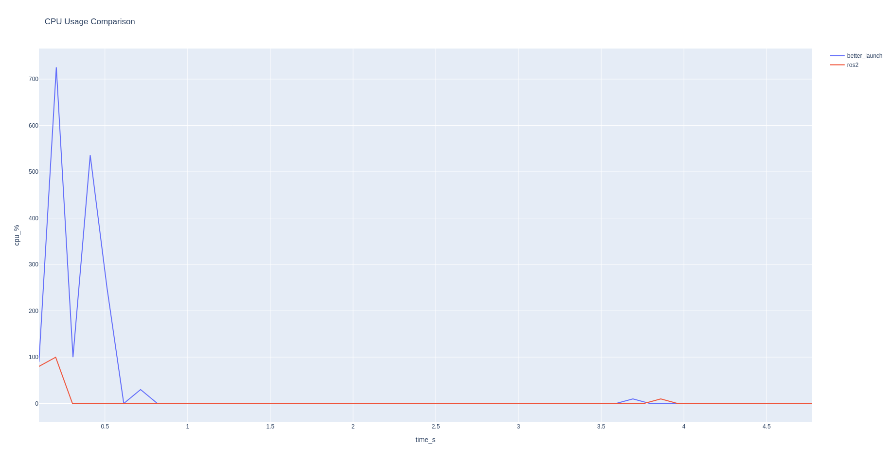
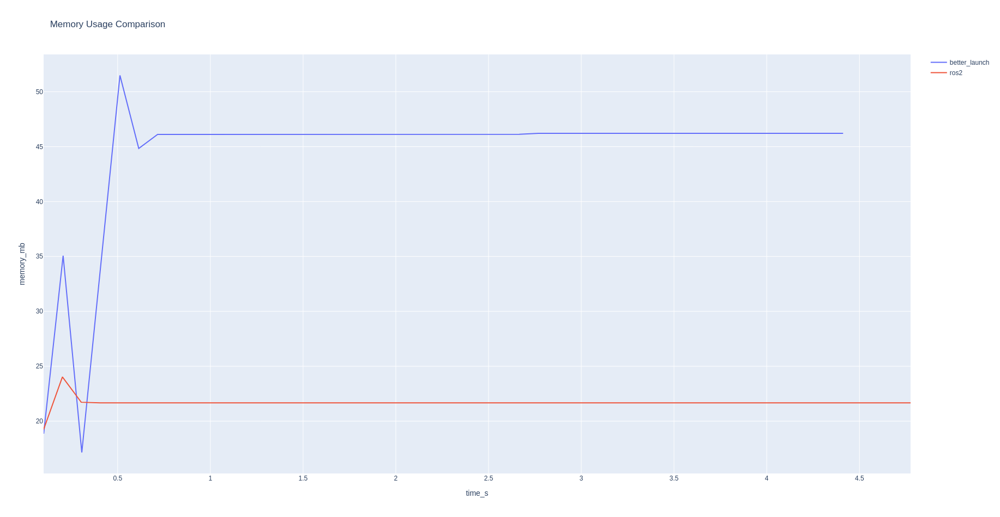
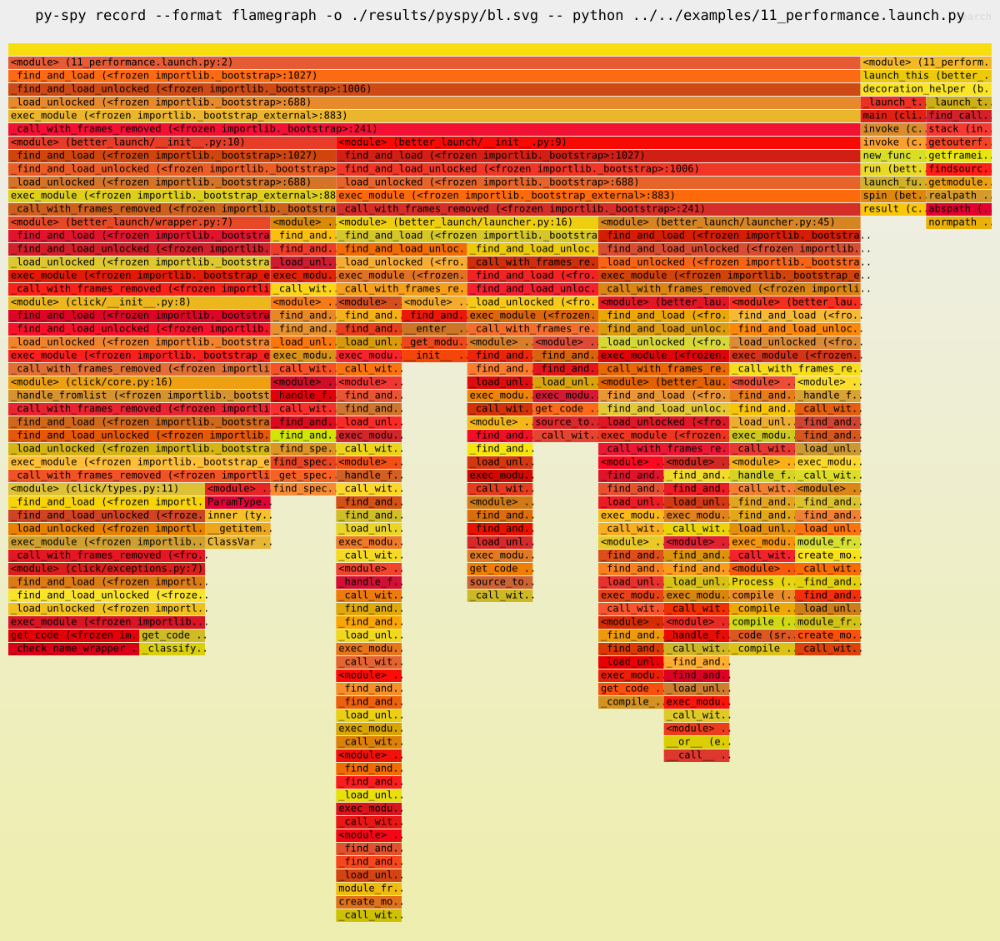
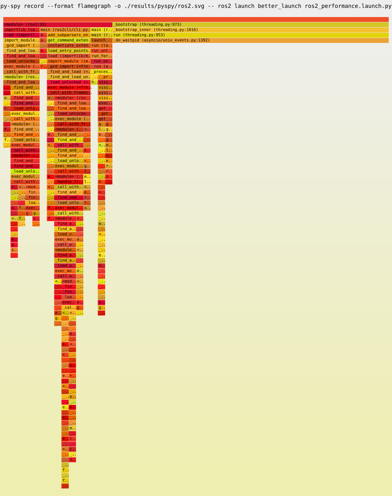

# :100: Performance
I am not an expert on profiling code. Even though *better_launch* uses synchronous calls (or classic threads if necessary), and does some additional work to reformat output from nodes, it was able to achieve similar performance to `ros2 launch`. The scripts and results from the benchmarks can be found under [benchmarks](https://github.com/dfki-ric/better_launch/tree/main/docs/benchmarks). This section will only show the most relevant parts.

???+ note

    `bl` is just a script to locate the launch file and then run it, so I decided to not use `bl` for these benchmarks and instead run the launch file directly; otherwise the resources used by the launch file will not be visible to most profilers.

??? example "memray"

    [memray](https://github.com/bloomberg/memray) reports that *better_launch* uses about 30% less memory than `ros2 launch`.

    |                   | better_launch | ros2 launch |
    | ----------------- | ------------- | ----------- |
    | allocations       | 48196         | 60943       |
    | peak memory usage | 6.6 MiB       | 9.7 MiB     |
    | details           | [link](../benchmarks/results/memray/memray-flamegraph-bl.html) | [link](../benchmarks/results/memray/memray-flamegraph-ros2.html) |

??? example "psutil"

    [psutil](https://psutil.readthedocs.io/en/latest/index.html#psutil.Process.memory_full_info) shows that *better_launch* uses more CPU in the beginning and more memory in total compared to `ros2 launch`. The memory reported is the unique set size (see the previous link). I'm not sure how these results relate to the memray statistics above. 

    

    

??? example "py-spy"

    I use [py-spy](https://github.com/benfred/py-spy) to see where *better_launch* is using resources that can still be optimized. The speedscope files can be visualized on [speedscope.app](https://www.speedscope.app/).

    

    
