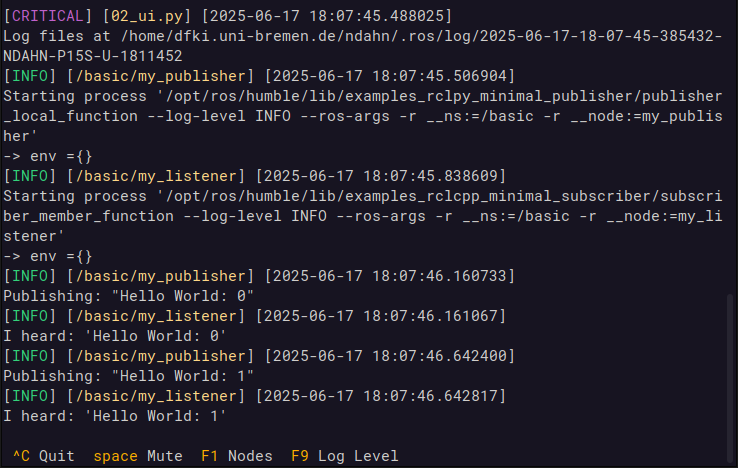
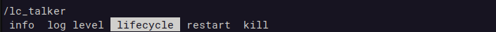
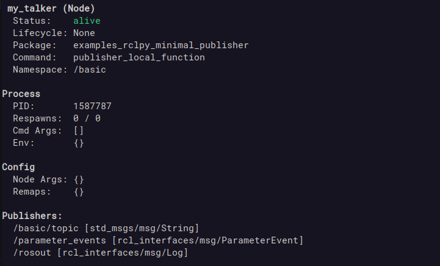

# :pager: The TUI

*better_launch* comes with a sneaky, unobstrusive TUI (terminal user interface) based on [prompt_toolkit](https://github.com/prompt-toolkit/python-prompt-toolkit), which will hover below the log output. You can start it by either passing `ui=True` to the `launch_this` wrapper, or by adding `--bl-ui true` on the command line. Use *\<tab>* to switch between menu items.

```bash
# Run this line to see it in action!
bl better_launch 02_ui.launch.py
```



See the single line at the bottom of the terminal? That's the TUI, and it will never take up more than 3 lines! Despite its simplicity, the TUI allows you a comfortable degree of control over all nodes managed by the *better_launch* process it is running in:

??? quote "list nodes and their status"

    

??? quote "control nodes (start, stop, lifecycle, ...)"

    

??? quote "change a node's log level"

    

??? quote "see a node's services and topics"

    

---

???+ tip

    It is possible to change the key bindings. The [settings page](settings.md#tui-shortcuts) contains further details.

## Foreign nodes

The TUI is also able to manage nodes started from different shells and processes, even if they have been started by ROS2 or other means. To do so, pass the `manage_foreign_nodes` flag to the wrapper or command line. Be aware though that this will not capture their output - to get their output you will have to use the *takeover* action from the TUI, which will *terminate and restart* the node process with the original arguments.

???+ note

    Foreign node processes are identified by having one of the following parameters in their arguments: `__ns`, `__name`, `__node`, `--ros-args`. This is always true for nodes started from launch files, but fails when they were started via `ros2 run` or other means. As far as I'm aware, there is no better way right now.
