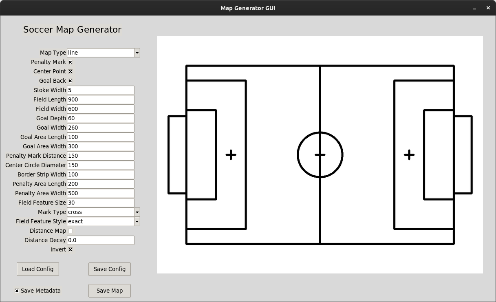

# Soccer Field Map Generator

[](../../actions/workflows/build_and_test_humble.yaml?query=branch:rolling)
[](../../actions/workflows/build_and_test_jazzy.yaml?query=branch:rolling)
[](../../actions/workflows/build_and_test_rolling.yaml?query=branch:rolling)

This repository contains a tool for generating soccer field maps. It includes a GUI for interactively creating and editing maps, as well as a command-line interface for scripted map generation.

## Installation

### Installation using ROS 2

To install the tool, run the following commands in your colcon workspace:

```shell
git clone git@github.com:ros-sports/soccer_field_map_generator.git src/soccer_field_map_generator
rosdep install --from-paths src --ignore-src -r -y
colcon build
```

Don't forget to source your workspace after building:

```shell
source install/setup.bash
```

### Installation using only Python

First I would recommend creating a virtual environment:

```shell
python3 -m venv venv
source venv/bin/activate
```

Then install the tool using pip:

```shell
pip install "git+https://github.com/ros-sports/soccer_field_map_generator.git#subdirectory=soccer_field_map_generator"
```


## Usage

### GUI

To launch the GUI, run the following command:

```shell
ros2 run soccer_field_map_generator gui
```

or this command if you installed the tool using pip:

```shell
python -m soccer_field_map_generator.gui
```

You should see a window like this:



### CLI

To generate a map using the command-line interface, run the following command:

```shell
ros2 run soccer_field_map_generator cli [output_file] [config_file] [options]
```

or this command if you installed the tool using pip:

```shell
python -m soccer_field_map_generator.cli [output_file] [config_file] [options]
```
